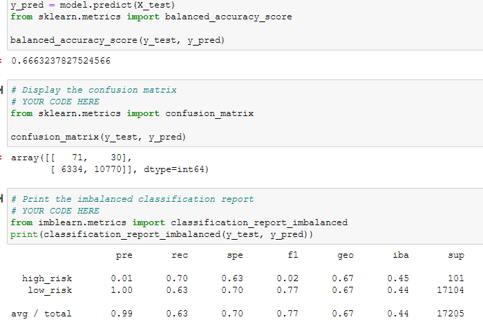
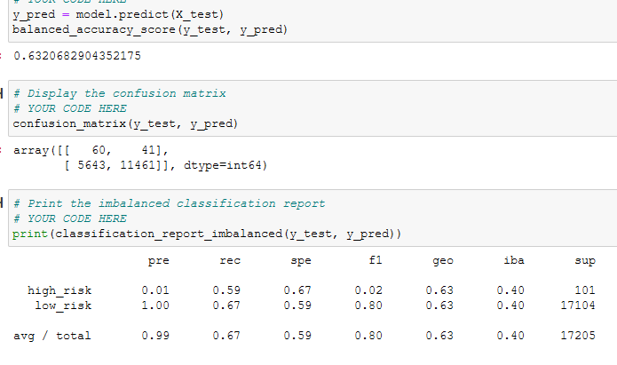
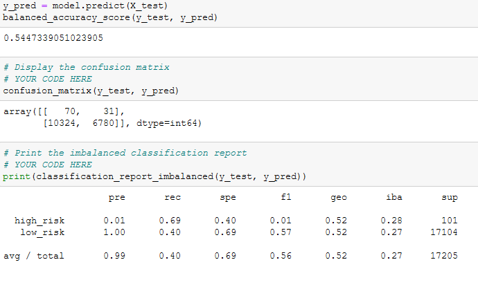
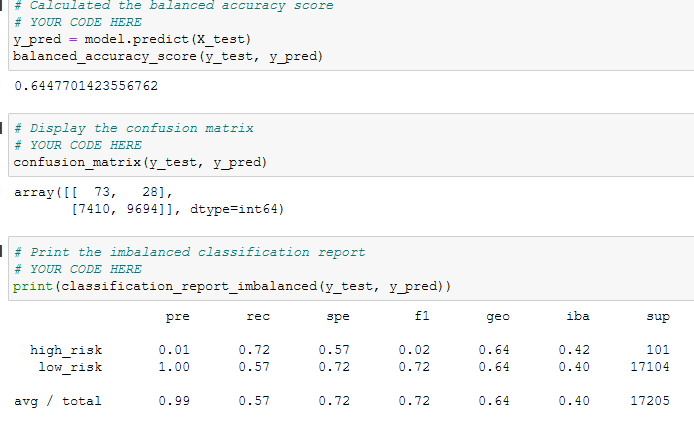
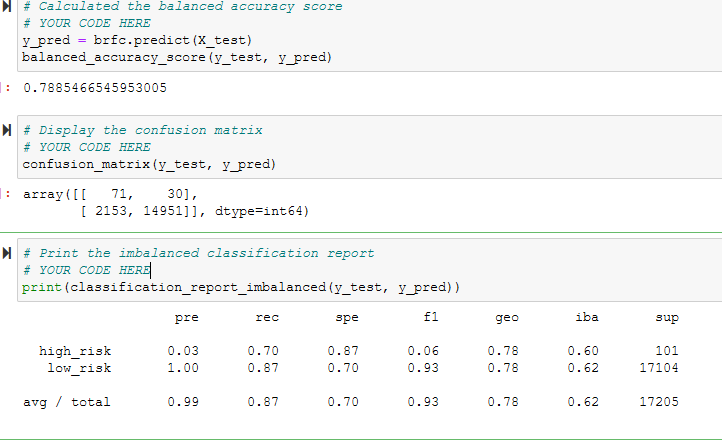
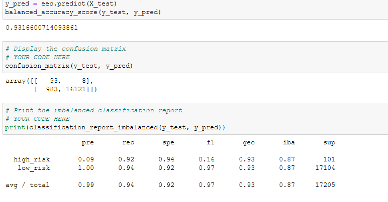

# Credit_risk_analysis

### Purpose
  The purpose of this exercise was to utilize imbalanced-learn and scikit-learn libraries to build and evaluate models using resampling data that would lead to apply machine learning to manage credit-risk. Using a credit card credit dataset from LendingClub lending services the analysis will use six different types algorithms and methods to determine which method provides applicable results.
  
### Results
#### Random oversampling
  
  ###### Using the random oversampling data above we can see that accuracy is about 66% and the low risk precision is notably 100% drawing skepticism to this this machine learning model overall. The recall for both high risk and lowrisk are both within acceptable bounds. 
#### Smote
  
  ###### The above data was retrieved using the smote machine learning model. The accuracy is 63% and both the presicion and recall are similar to the random sampling method previously done, albeit worse for the recall.
#### Undersampling
  
  ###### The above data was provided using undersampling method, notably using the Cluster Centroids algorithm. The accuracy score for this model was 54% and again both the precision and recall are similar to the previous models barring recall for low risk htting a new low of 40%.
#### Smoteenn
  
  ###### Using the Smoteenn method; a combination of under and oversampling. The accuracy using this method was 64% and the precision and recall are also similar to the previous models notably close to the first random oversampling.
#### Balanced Random Forest Classifier
  
  ###### The above data was accrued using the Balanced Random Forest Classifier method with an accuracy score of 78%. The precision values for high risk are notably higher than the previous methods at a 3%, while the low risk remained at 100%. The recall values for high risk and low risk are 70% and 87% respectivly.
#### Easy Ensemble Classifier

  ###### The above data was achevied using the Easy ensemble classifier method with the highest accuracy score of all the previous models with 93%. The precision for high risk was also the highest with 9% and the similar 100% for low risk. The recall was also the highest performing from all the other models, with 92% in high risk and 94% in low risk.

### Summary
  Upon viewing the results of the analysis there seem to be a few red flags involving the disparity with the high precision rate for low risk percent and low presicion rate with the high risk percent with all the models, perhaps indicating some issue with the data. Taking in all the models results the model that provides the most promising information would be the Easy ensemble classifier as this model provided high recall rates and the highest high risk precision against all the other models. With the easy ensemble classifier providing the most promising results it cannot be easily recommended to use as it seems particulary weak at predicting high risk, however it did provide the best over all high risk results among all the other models. I cautiously reccomend using the easy ensemble classifer model knowing its shortcomings.
